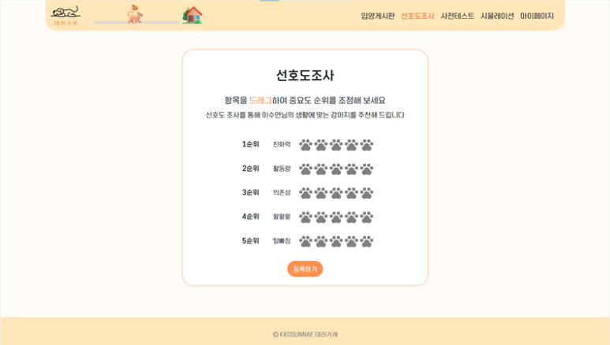
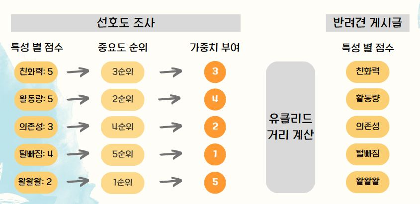
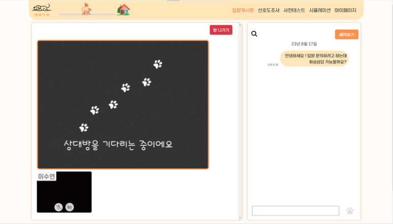
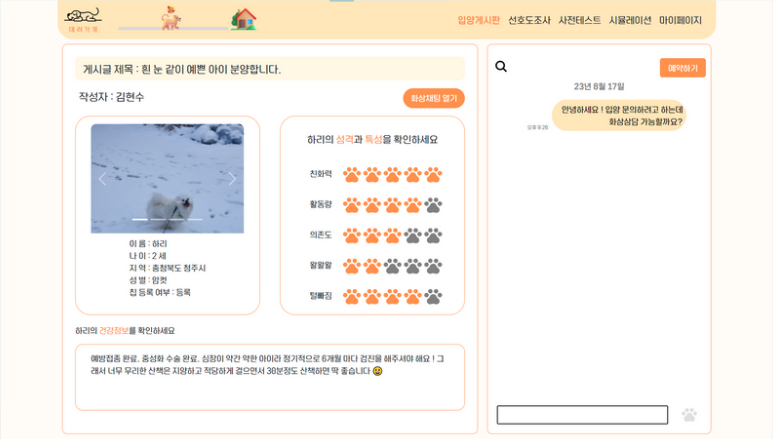
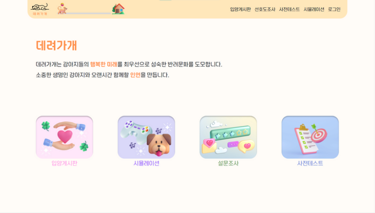
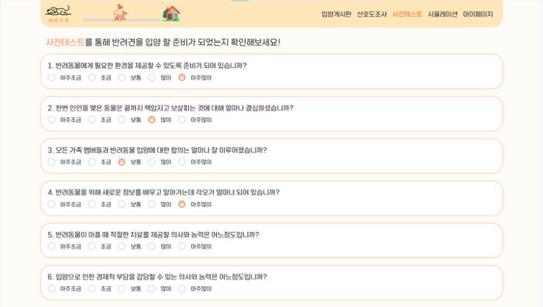
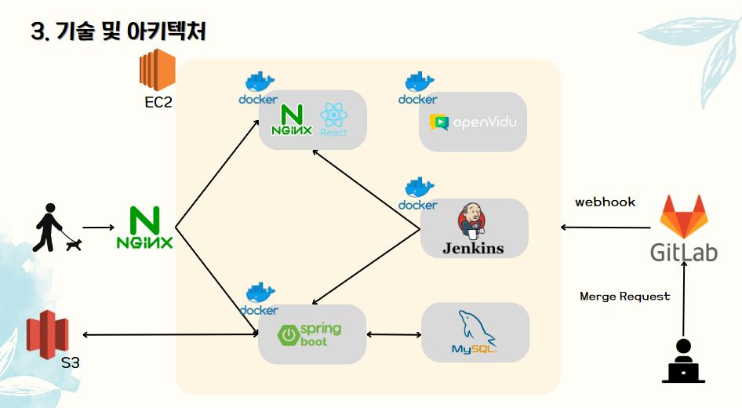
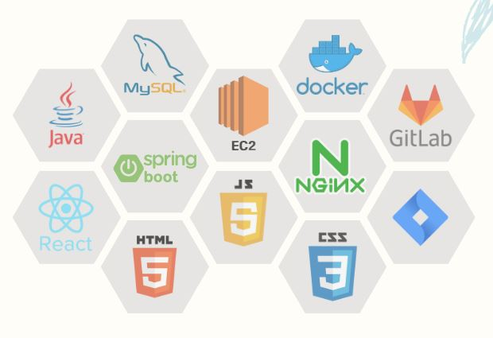

# 데려가개

한 줄 소개: 다양한 방식으로 입양 만족도를 높임으로써 강아지 유기와 파양률을 낮추기 위한 플랫폼
진행 기간: 2023/07/03 → 2023/08/18
담당 Skills & 사용 Libraries: Axios, HTML/CSS, JavaScript, React, Recoil
팀 구성: Backend 4명, Frontend2명

### 🔗Link

**Source**

[https://github.com/ksykma/Deryeogage](https://github.com/ksykma/Deryeogage)

## 📑 프로젝트 소개

### ✅ **서비스 목적**

반려동물을 유기하거나 파양하는 경우가 비일비재함에 따라 법 제도 하에서 해결하기 어려운 문제가 존재하며, 집에서 새끼를 낳았을 때 적합 입양처를 찾기 어려운 경우가 존재

→ 이를 개인 간 활발한 입양 문화로 해결하고자 함

### ✅ **기획 의도 및 배경**

**: 데려가개**를 통해 **입양 만족도를 높임**으로써 **유기와 파양률을 줄이자!**

**[문제 제기 1]**

더 이상 집에 돌봐줄 사람이 없어서 반려동물을 키우지 못하게 된 경우

**[문제 제기 2]**

반려견이 새끼를 낳았는데 주변에 마땅히 분양 시킬 사람을 찾지 못한 경우

**[솔루션 도출]** 

다양한 절차를 통해 분양 시킬 반려동물과 잘 맞는, 책임감 있는 입양자를 매칭시켜 주고 입양 만족도를 높임으로써 유기와 파양률을 줄일 수 있지 않을까?

## 📖 프로젝트 상세

<aside>
🐶 **삼성 소프트웨어 아카데미**에서 진행한 첫 번째 프로젝트입니다. 데려가개는 입양자와 강아지의 정보를 받아 매칭시켜주고 분양자는 입양자의 사전테스트, 설문조사, 시뮬레이션 게임 결과 등을 확인하여 반려동물을 케어할 준비가 된 사람인지 확인할 수 있습니다. 팀원들 중 유기견 보호센터에서  강아지를 입양한 분들이 많았는데, 강아지와 입양자 모두가 행복하려면 어떻게 해야 할까라는 생각에서 아이디어가 나오게 되었습니다.

</aside>

### ✅ 주요 기능

- 강아지 케어 시뮬레이션 게임

: 반려동물을 하루동안 케어하는 경험을 제공함으로써 플레이하는 유저가 입양에 조금 더 경각심을 갖게 됨

- 선호도 조사 및 강아지 추천

: 입양자의 선호도조사 결과와, 강아지의 특성 값을 계산하여 입양자와 가장 잘 맞는 강아지를 추천

- 추천 알고리즘

    

- 화상 및 채팅 기능

    
    

### ✅ 그 외의 기능들

- 메인화면
    
    
    
- 사전테스트
    
    
    
- 책임비

    
    
    
    

### ✅ 아키텍쳐

## 📚 산출물(ERD, 명세서)

### ERD, 요구사항 **명세서**

[https://docs.google.com/spreadsheets/d/1Au8AMyQxadTBgua0hidnLZUdd4uqpJ5sLf7sEL0pprA/edit#gid=0](https://docs.google.com/spreadsheets/d/1Au8AMyQxadTBgua0hidnLZUdd4uqpJ5sLf7sEL0pprA/edit#gid=0)

## 🛠️ 사용 기술 및 라이브러리

- Bank-End : MySQL, Java, Spring boot
- Front-End : React, JavaScript, CSS, openVidu
- Deploy : docker
- tools : GitLab, [Figma](https://www.figma.com/file/YsmApjVNNuaZNTyt9xM8mk/%EB%8D%B0%EB%A0%A4%EA%B0%80%EA%B0%9C?type=design&node-id=0-1&mode=design&t=EfguZC7QHGCyvzPH-0)

## 📱 담당한 기능 (Frontend)

- UI&UX 설계
- **시뮬레이션 게임** 화면 및 기능 구현
- **메인페이지** 화면 구현
- **마이페이지** 화면 및 기능 구현

## 💡 깨달은 점

- 코드에 주석을 잘 달아놔야 나중에 봤을 때 헷갈리지 않는다.
- 코드가 꼬이지 않도록 컴포넌트 구조를 잘 설계 해야 한다. → 시뮬레이션 컴포넌트 안에 하위 컴포넌트를 바꿔끼는 형식으로 시뮬레이션 게임을 구현하였는데 코드 충돌이 여러번 일어남😥